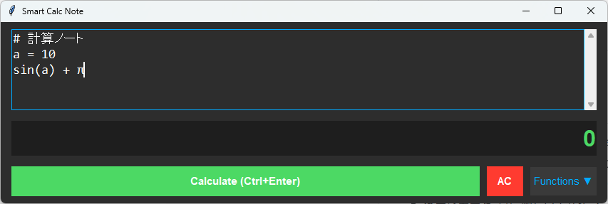

# smart-calc-note
Pythonで作った、変数定義ができるノート形式の関数電卓です。

## 特徴
- **変数定義**: `a = 10` のように値を保存して再利用可能
- **複数行計算**: 複雑な計算をステップに分けて記述
- **安全設計**: `eval()` を使わず、独自の解析エンジン（操車場アルゴリズム）で実装
- **ダークモード**: 目に優しいデザイン

## 使い方
1. Pythonをインストール
2. `python main.py` で実行
3. `Ctrl + Enter` で計算実行！
